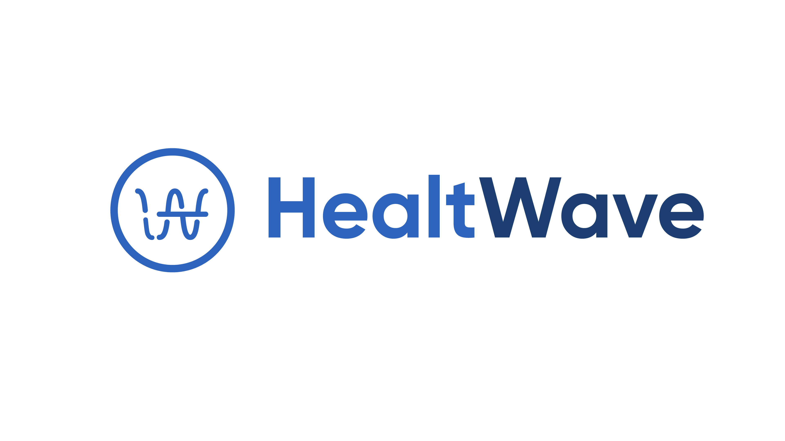
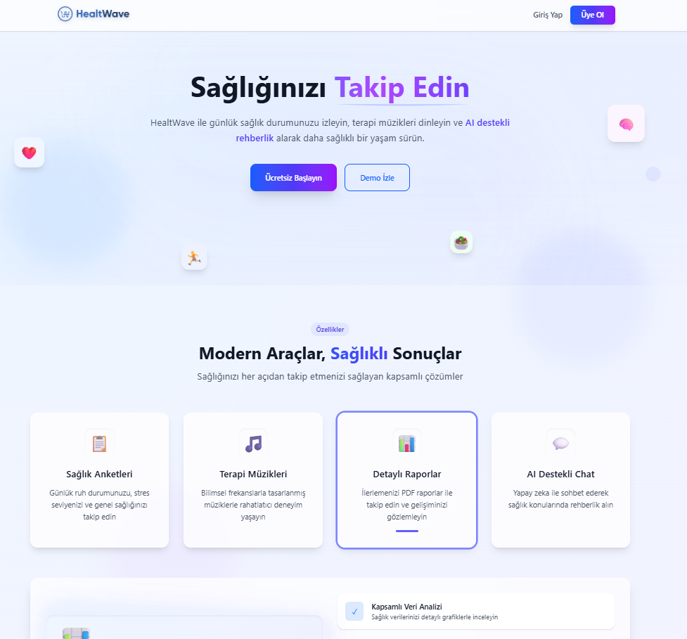
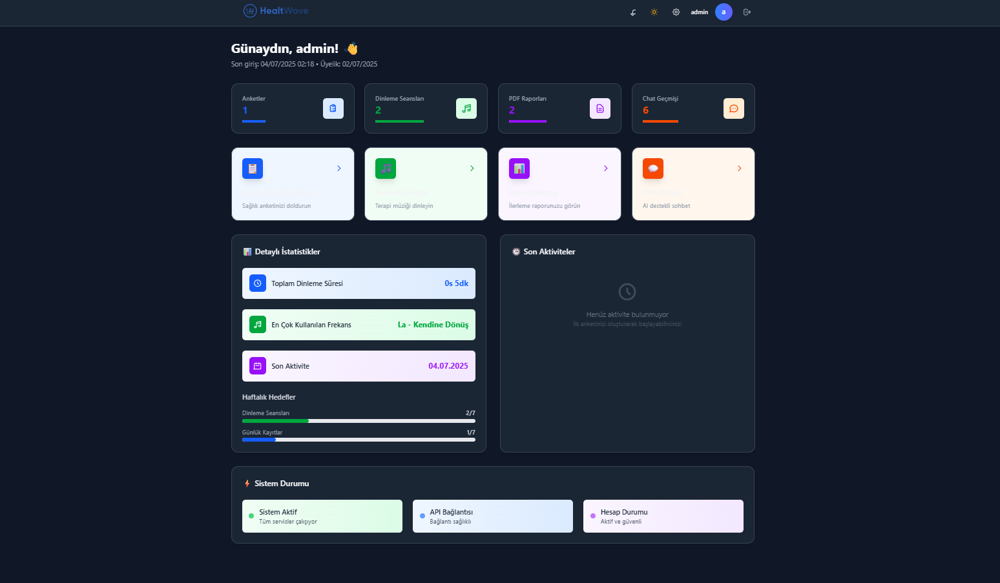
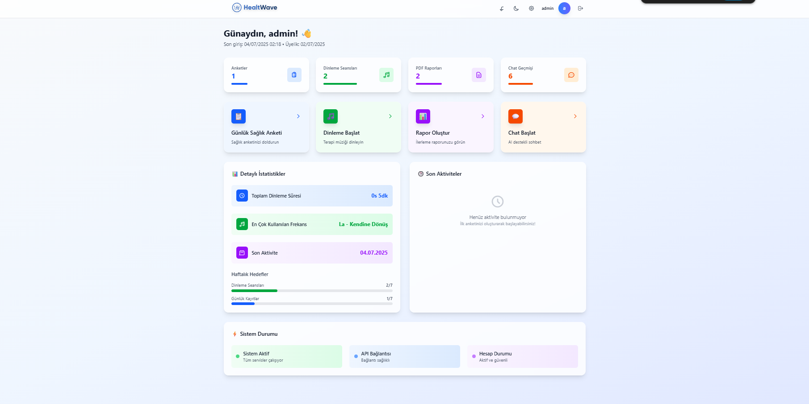
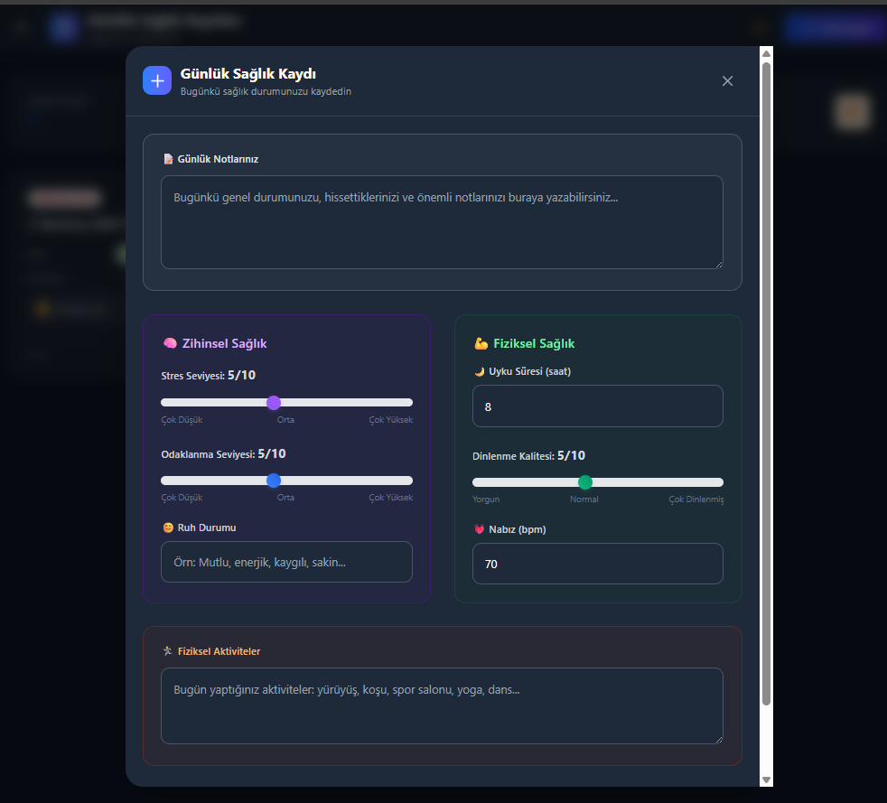
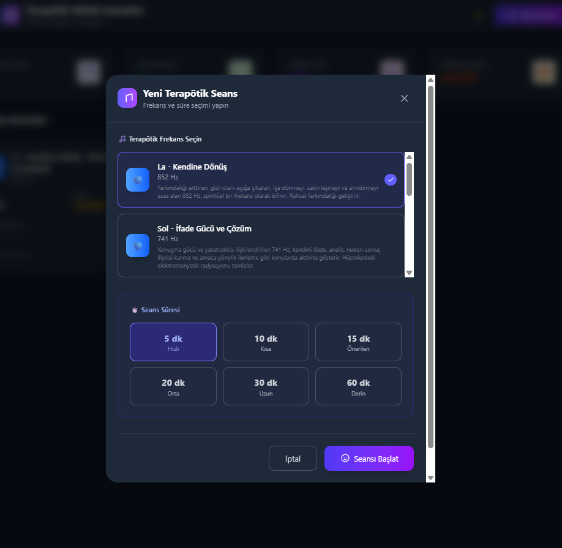
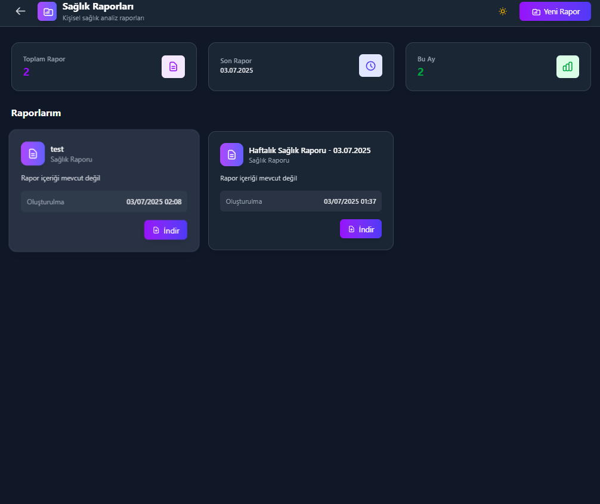
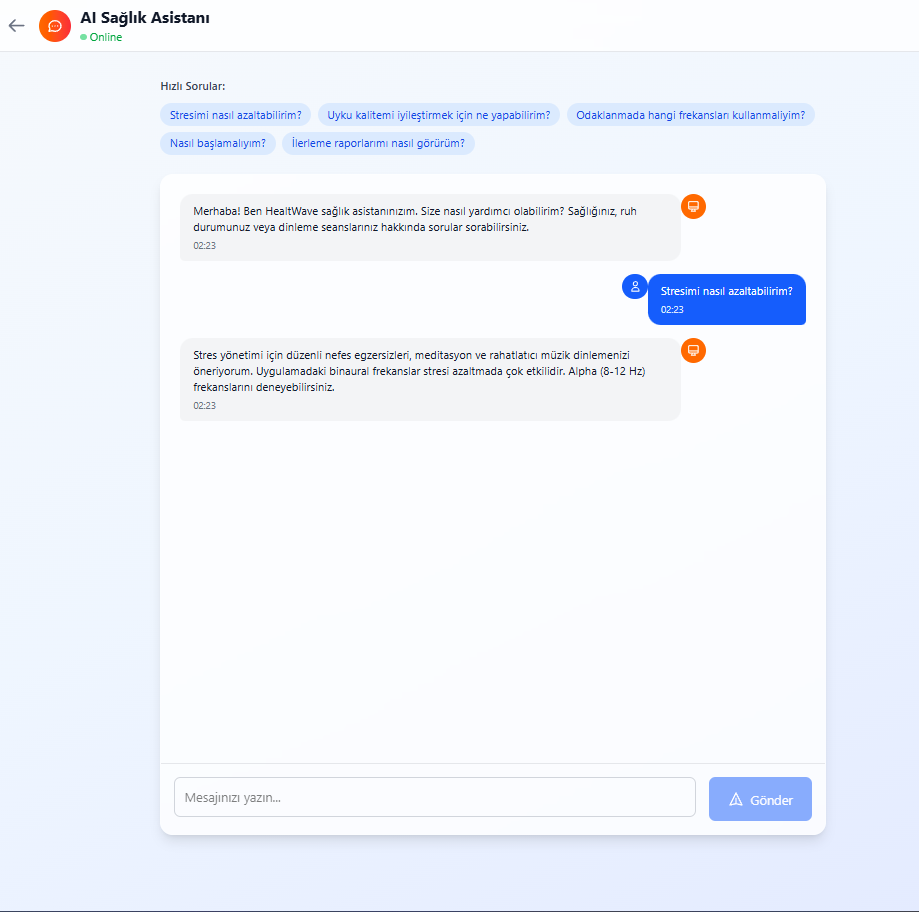

  
  

  <h1>
    <picture>
      <source media="(prefers-color-scheme: dark)" srcset="https://readme-typing-svg.demolab.com?font=Fira+Code&size=28&duration=4000&pause=1000&color=00D4FF&center=true&vCenter=true&multiline=true&width=800&height=100&lines=🌊+HealthWave;Solfeggio+Frekans+Terapisi+Platformu">
      
    </picture>
  </h1>

  

    <em>🎵 Ses terapisi ile zihinsel ve fiziksel sağlığınızı destekleyin 🎵</em>
  

   

  

    
    
    
    
    
  

   

  

    
    
    
    
    
  

   

  

    
    
    
    
  

   

  

    
    
    
  

 

---

  <h2>
    
    <em>Sağlık + Teknoloji = Yaşam Kalitesi</em>
    
  </h2>

---

  
  <h2>
    
    
    📋 İçindekiler
    
    
  </h2>

  <table style="border-collapse: collapse; width: 100%; margin: 20px 0;">
    <tr>
      <td align="center" style="padding: 15px; background: linear-gradient(135deg, #667eea 0%, #764ba2 100%); border-radius: 10px; margin: 5px;">
        <a href="#-proje-hakkında" style="text-decoration: none; color: white; font-weight: bold; font-size: 14px;">
          🎵 Proje Hakkında
        </a>
      </td>
      <td align="center" style="padding: 15px; background: linear-gradient(135deg, #f093fb 0%, #f5576c 100%); border-radius: 10px; margin: 5px;">
        <a href="#-özellikler" style="text-decoration: none; color: white; font-weight: bold; font-size: 14px;">
          ✨ Özellikler
        </a>
      </td>
      <td align="center" style="padding: 15px; background: linear-gradient(135deg, #4facfe 0%, #00f2fe 100%); border-radius: 10px; margin: 5px;">
        <a href="#-teknoloji-stack" style="text-decoration: none; color: white; font-weight: bold; font-size: 14px;">
          🛠 Teknoloji Stack
        </a>
      </td>
    </tr>
    <tr>
      <td align="center" style="padding: 15px; background: linear-gradient(135deg, #43e97b 0%, #38f9d7 100%); border-radius: 10px; margin: 5px;">
        <a href="#-kurulum" style="text-decoration: none; color: white; font-weight: bold; font-size: 14px;">
          🚀 Kurulum
        </a>
      </td>
      <td align="center" style="padding: 15px; background: linear-gradient(135deg, #fa709a 0%, #fee140 100%); border-radius: 10px; margin: 5px;">
        <a href="#-api-dokümantasyonu" style="text-decoration: none; color: white; font-weight: bold; font-size: 14px;">
          📚 API Dokümantasyonu
        </a>
      </td>
      <td align="center" style="padding: 15px; background: linear-gradient(135deg, #a8edea 0%, #fed6e3 100%); border-radius: 10px; margin: 5px;">
        <a href="#-kullanım" style="text-decoration: none; color: white; font-weight: bold; font-size: 14px;">
          🎮 Kullanım
        </a>
      </td>
    </tr>
    <tr>
      <td align="center" style="padding: 15px; background: linear-gradient(135deg, #ffecd2 0%, #fcb69f 100%); border-radius: 10px; margin: 5px;">
        <a href="#-ekran-görüntüleri" style="text-decoration: none; color: white; font-weight: bold; font-size: 14px;">
          📸 Ekran Görüntüleri
        </a>
      </td>
      <td align="center" style="padding: 15px; background: linear-gradient(135deg, #ff9a9e 0%, #fecfef 100%); border-radius: 10px; margin: 5px;">
        <a href="#-geliştirme-ortamı" style="text-decoration: none; color: white; font-weight: bold; font-size: 14px;">
          🔧 Geliştirme Ortamı
        </a>
      </td>
      <td align="center" style="padding: 15px; background: linear-gradient(135deg, #a18cd1 0%, #fbc2eb 100%); border-radius: 10px; margin: 5px;">
        <a href="#-lisans" style="text-decoration: none; color: white; font-weight: bold; font-size: 14px;">
          📝 Lisans
        </a>
      </td>
    </tr>
  </table>

 

  

  
  <h2>
    
    
      🎵 Proje Hakkında
    
    
  </h2>

  <table style="border: 2px solid #667eea; border-radius: 15px; background: linear-gradient(135deg, #ffeef8 0%, #f0f8ff 100%); padding: 20px; margin: 20px 0;">
    <tr>
      <td align="center" style="padding: 20px;">
        <h3 style="color: #667eea; margin-bottom: 15px;">🌊 HealthWave</h3>
        

          <strong>Solfeggio frekansları</strong> kullanarak kullanıcıların zihinsel ve fiziksel sağlığını desteklemeyi amaçlayan <em>modern bir platform projesidir</em>. Platform, ses terapisi, günlük sağlık takibi ve yapay zeka destekli chatbot ile kişiselleştirilmiş öneriler sunarak kullanıcıların genel yaşam kalitesini artırmayı hedefler.
        

      </td>
    </tr>
  </table>

 

  <h3>
    
    🎯 Temel Hedefler
    
  </h3>

  <table style="width: 100%; border-collapse: collapse; margin: 20px 0;">
    <tr>
      <td align="center" style="padding: 20px; background: linear-gradient(135deg, #667eea 0%, #764ba2 100%); border-radius: 15px; margin: 10px; color: white;">
        <h4 style="margin: 0 0 10px 0; font-size: 18px;">🧘‍♀️ Stres Azaltma</h4>
        
Alpha ve Theta dalgaları ile doğal stres giderme

      </td>
      <td align="center" style="padding: 20px; background: linear-gradient(135deg, #f093fb 0%, #f5576c 100%); border-radius: 15px; margin: 10px; color: white;">
        <h4 style="margin: 0 0 10px 0; font-size: 18px;">💤 Uyku Kalitesi</h4>
        
Delta frekansları ile derin ve kaliteli uyku

      </td>
    </tr>
    <tr>
      <td align="center" style="padding: 20px; background: linear-gradient(135deg, #4facfe 0%, #00f2fe 100%); border-radius: 15px; margin: 10px; color: white;">
        <h4 style="margin: 0 0 10px 0; font-size: 18px;">🎯 Odaklanma</h4>
        
Beta dalgaları ile konsantrasyon artırma

      </td>
      <td align="center" style="padding: 20px; background: linear-gradient(135deg, #43e97b 0%, #38f9d7 100%); border-radius: 15px; margin: 10px; color: white;">
        <h4 style="margin: 0 0 10px 0; font-size: 18px;">🔍 Takip ve Analiz</h4>
        
Günlük sağlık verilerinin analizi

      </td>
    </tr>
  </table>

 

  

  
  <h2>
    
    
      ✨ Özellikler
    
    
  </h2>

  

 

  <table style="width: 100%; border-collapse: collapse; margin: 20px 0;">
    <tr>
      <td style="width: 50%; padding: 20px; background: linear-gradient(135deg, #667eea 0%, #764ba2 100%); border-radius: 15px; margin: 10px; color: white; vertical-align: top;">
        <h3 style="margin: 0 0 15px 0; font-size: 20px; text-align: center;">
          🔊 Ses Terapisi
        </h3>
        <ul style="list-style: none; padding: 0; margin: 0;">
          <li style="margin: 10px 0; padding: 8px 0; border-bottom: 1px solid rgba(255,255,255,0.3);">
            <strong>🎵 Solfeggio Frekansları:</strong> 174Hz, 285Hz, 396Hz, 417Hz, 528Hz, 639Hz, 741Hz, 852Hz, 963Hz şifa frekansları
          </li>
          <li style="margin: 10px 0; padding: 8px 0; border-bottom: 1px solid rgba(255,255,255,0.3);">
            <strong>⚙️ Özelleştirilebilir Seanslar:</strong> Süre ve frekans seçimi
          </li>
          <li style="margin: 10px 0; padding: 8px 0; border-bottom: 1px solid rgba(255,255,255,0.3);">
            <strong>🎧 Yüksek Kalite Audio:</strong> MP3 formatlarında kristal netlikte ses
          </li>
          <li style="margin: 10px 0; padding: 8px 0;">
            <strong>🧬 Bilimsel Temelli:</strong> Araştırmalara dayalı frekans terapisi
          </li>
        </ul>
      </td>
      <td style="width: 50%; padding: 20px; background: linear-gradient(135deg, #f093fb 0%, #f5576c 100%); border-radius: 15px; margin: 10px; color: white; vertical-align: top;">
        <h3 style="margin: 0 0 15px 0; font-size: 20px; text-align: center;">
          📊 Sağlık Takibi
        </h3>
        <ul style="list-style: none; padding: 0; margin: 0;">
          <li style="margin: 10px 0; padding: 8px 0; border-bottom: 1px solid rgba(255,255,255,0.3);">
            <strong>📝 Günlük Anketler:</strong> Stres, uyku, odaklanma ve genel sağlık durumu
          </li>
          <li style="margin: 10px 0; padding: 8px 0; border-bottom: 1px solid rgba(255,255,255,0.3);">
            <strong>📈 İlerleme Analizi:</strong> Zaman içindeki gelişimin grafikleri
          </li>
          <li style="margin: 10px 0; padding: 8px 0; border-bottom: 1px solid rgba(255,255,255,0.3);">
            <strong>🎯 Kişiselleştirilmiş Öneriler:</strong> AI destekli sağlık tavsiyeleri
          </li>
          <li style="margin: 10px 0; padding: 8px 0;">
            <strong>📄 PDF Raporlar:</strong> Detaylı sağlık analiz raporları
          </li>
        </ul>
      </td>
    </tr>
    <tr>
      <td style="width: 50%; padding: 20px; background: linear-gradient(135deg, #4facfe 0%, #00f2fe 100%); border-radius: 15px; margin: 10px; color: white; vertical-align: top;">
        <h3 style="margin: 0 0 15px 0; font-size: 20px; text-align: center;">
          🤖 Yapay Zeka Chatbot
        </h3>
        <ul style="list-style: none; padding: 0; margin: 0;">
          <li style="margin: 10px 0; padding: 8px 0; border-bottom: 1px solid rgba(255,255,255,0.3);">
            <strong>🌐 7/24 AI Destek:</strong> Yapay zeka ile sağlık ve frekans konularında anında yardım
          </li>
          <li style="margin: 10px 0; padding: 8px 0; border-bottom: 1px solid rgba(255,255,255,0.3);">
            <strong>📚 Eğitici İçerik:</strong> Solfeggio frekansları ve sağlık hakkında bilgiler
          </li>
          <li style="margin: 10px 0; padding: 8px 0;">
            <strong>🗣️ Doğal Dil İşleme:</strong> İnsan benzeri etkileşim deneyimi
          </li>
        </ul>
      </td>
      <td style="width: 50%; padding: 20px; background: linear-gradient(135deg, #43e97b 0%, #38f9d7 100%); border-radius: 15px; margin: 10px; color: white; vertical-align: top;">
        <h3 style="margin: 0 0 15px 0; font-size: 20px; text-align: center;">
          📱 Modern Arayüz
        </h3>
        <ul style="list-style: none; padding: 0; margin: 0;">
          <li style="margin: 10px 0; padding: 8px 0; border-bottom: 1px solid rgba(255,255,255,0.3);">
            <strong>💻 Responsive Web:</strong> Mobil, tablet ve masaüstü uyumlu web arayüzü
          </li>
          <li style="margin: 10px 0; padding: 8px 0; border-bottom: 1px solid rgba(255,255,255,0.3);">
            <strong>📱 Android Uygulaması:</strong> Kotlin ile geliştirilmiş native Android app
          </li>
          <li style="margin: 10px 0; padding: 8px 0; border-bottom: 1px solid rgba(255,255,255,0.3);">
            <strong>🌙 Koyu/Açık Tema:</strong> Göz dostu tema seçenekleri
          </li>
          <li style="margin: 10px 0; padding: 8px 0;">
            <strong>🎨 Modern UI/UX:</strong> Çağdaş tasarım anlayışı
          </li>
        </ul>
      </td>
    </tr>
  </table>

 

  

  
  <h2>
    
    
      🛠 Teknoloji Stack
    
    
  </h2>

  

 

  <table style="width: 100%; border-collapse: collapse; margin: 20px 0;">
    <tr>
      <td style="width: 50%; padding: 25px; background: linear-gradient(135deg, #667eea 0%, #764ba2 100%); border-radius: 20px; margin: 10px; color: white; vertical-align: top;">
        <h3 style="margin: 0 0 20px 0; font-size: 24px; text-align: center;">
          🌐 Backend
        </h3>
        

          
          
          
        

        <ul style="list-style: none; padding: 0; margin: 0;">
          <li style="margin: 12px 0; padding: 10px 0; border-bottom: 1px solid rgba(255,255,255,0.3);">
            <strong>🚀 Framework:</strong> Django 4.2 + Django REST Framework
          </li>
          <li style="margin: 12px 0; padding: 10px 0; border-bottom: 1px solid rgba(255,255,255,0.3);">
            <strong>🗄️ Veritabanı:</strong> Supabase PostgreSQL
          </li>
          <li style="margin: 12px 0; padding: 10px 0; border-bottom: 1px solid rgba(255,255,255,0.3);">
            <strong>🔐 Kimlik Doğrulama:</strong> JWT (Simple JWT)
          </li>
          <li style="margin: 12px 0; padding: 10px 0; border-bottom: 1px solid rgba(255,255,255,0.3);">
            <strong>📡 API:</strong> RESTful API (POSTMAN Dokümantasyonu)
          </li>
          <li style="margin: 12px 0; padding: 10px 0; border-bottom: 1px solid rgba(255,255,255,0.3);">
            <strong>☁️ Dosya Depolama:</strong> Supabase Storage
          </li>
          <li style="margin: 12px 0; padding: 10px 0; border-bottom: 1px solid rgba(255,255,255,0.3);">
            <strong>⚡ Gerçek Zamanlı:</strong> Supabase Realtime
          </li>
          <li style="margin: 12px 0; padding: 10px 0;">
            <strong>🔒 Güvenlik:</strong> CORS, throttling, rate limiting
          </li>
        </ul>
      </td>
      <td style="width: 50%; padding: 25px; background: linear-gradient(135deg, #f093fb 0%, #f5576c 100%); border-radius: 20px; margin: 10px; color: white; vertical-align: top;">
        <h3 style="margin: 0 0 20px 0; font-size: 24px; text-align: center;">
          💻 Frontend
        </h3>
        

          
          
          
        

        <ul style="list-style: none; padding: 0; margin: 0;">
          <li style="margin: 12px 0; padding: 10px 0; border-bottom: 1px solid rgba(255,255,255,0.3);">
            <strong>🌐 Web Framework:</strong> Next.js 14 (App Router)
          </li>
          <li style="margin: 12px 0; padding: 10px 0; border-bottom: 1px solid rgba(255,255,255,0.3);">
            <strong>📱 Mobile:</strong> Kotlin (Android Native)
          </li>
          <li style="margin: 12px 0; padding: 10px 0; border-bottom: 1px solid rgba(255,255,255,0.3);">
            <strong>🔤 Dil:</strong> TypeScript, Kotlin
          </li>
          <li style="margin: 12px 0; padding: 10px 0; border-bottom: 1px solid rgba(255,255,255,0.3);">
            <strong>🎨 Stil:</strong> Tailwind CSS
          </li>
          <li style="margin: 12px 0; padding: 10px 0; border-bottom: 1px solid rgba(255,255,255,0.3);">
            <strong>🔄 State Yönetimi:</strong> React Context + Hooks
          </li>
          <li style="margin: 12px 0; padding: 10px 0; border-bottom: 1px solid rgba(255,255,255,0.3);">
            <strong>🌐 HTTP İstemcisi:</strong> Fetch API, Retrofit (Android)
          </li>
          <li style="margin: 12px 0; padding: 10px 0; border-bottom: 1px solid rgba(255,255,255,0.3);">
            <strong>🎛️ UI Bileşenleri:</strong> Özel + Material Design (Android)
          </li>
          <li style="margin: 12px 0; padding: 10px 0;">
            <strong>🎵 Audio Player:</strong> HTML5 audio + MediaPlayer (Android)
          </li>
        </ul>
      </td>
    </tr>
  </table>

 

  
  
  
  
  
  

  
  <h2>
    
    
      🚀 Kurulum
    
    
  </h2>

  

 

  <table style="background: linear-gradient(135deg, #667eea 0%, #764ba2 100%); border-radius: 20px; padding: 20px; margin: 20px 0; color: white;">
    <tr>
      <td align="center" style="padding: 15px;">
        <h3 style="margin: 0 0 15px 0; font-size: 20px;">
          📋 Gereksinimler
        </h3>
        

          
          
          
          
          
        

      </td>
    </tr>
  </table>

 

  <table style="width: 100%; border-collapse: collapse; margin: 20px 0;">
    <tr>
      <td style="width: 100%; padding: 20px; background: linear-gradient(135deg, #f093fb 0%, #f5576c 100%); border-radius: 15px; margin: 10px 0; color: white;">
        <h3 style="margin: 0 0 15px 0; font-size: 20px; text-align: center;">
          📥 1. Repository'yi Klonlayın
        </h3>
        

          <code>git clone https://github.com/kullaniciadi/healthwave.git</code> 
          <code>cd healthwave</code>
        

      </td>
    </tr>
    <tr>
      <td style="width: 100%; padding: 20px; background: linear-gradient(135deg, #4facfe 0%, #00f2fe 100%); border-radius: 15px; margin: 10px 0; color: white;">
        <h3 style="margin: 0 0 15px 0; font-size: 20px; text-align: center;">
          🌐 2. Backend Kurulumu
        </h3>
        

          <code># Backend dizinine geçin</code> 
          <code>cd backend</code>  
          <code># Virtual environment oluşturun</code> 
          <code>python -m venv venv</code>  
          <code># Virtual environment'ı aktifleştirin</code> 
          <code># Windows:</code> 
          <code>venv\Scripts\activate</code> 
          <code># macOS/Linux:</code> 
          <code>source venv/bin/activate</code>  
          <code># Bağımlılıkları yükleyin</code> 
          <code>pip install -r requirements.txt</code>  
          <code># Veritabanı migration'larını çalıştırın</code> 
          <code>python manage.py makemigrations</code> 
          <code>python manage.py migrate</code>  
          <code># Superuser oluşturun (opsiyonel)</code> 
          <code>python manage.py createsuperuser</code>  
          <code># Test verilerini oluşturun (opsiyonel)</code> 
          <code>python manage.py generate_sample_data</code>  
          <code># Backend sunucusunu başlatın</code> 
          <code>python manage.py runserver</code>
        

      </td>
    </tr>
    <tr>
      <td style="width: 100%; padding: 20px; background: linear-gradient(135deg, #43e97b 0%, #38f9d7 100%); border-radius: 15px; margin: 10px 0; color: white;">
        <h3 style="margin: 0 0 15px 0; font-size: 20px; text-align: center;">
          💻 3. Frontend Kurulumu
        </h3>
        

          <code># Yeni terminal açın ve frontend dizinine geçin</code> 
          <code>cd frontend</code>  
          <code># Bağımlılıkları yükleyin</code> 
          <code>npm install</code> 
          <code># veya</code> 
          <code>yarn install</code>  
          <code># Development sunucusunu başlatın</code> 
          <code>npm run dev</code> 
          <code># veya</code> 
          <code>yarn dev</code>
        

      </td>
    </tr>
    <tr>
      <td style="width: 100%; padding: 20px; background: linear-gradient(135deg, #fa709a 0%, #fee140 100%); border-radius: 15px; margin: 10px 0; color: white;">
        <h3 style="margin: 0 0 15px 0; font-size: 20px; text-align: center;">
          🌐 4. Erişim URL'leri
        </h3>
        

          

            <strong>Frontend:</strong> http://localhost:3000
          

          

            <strong>Backend API:</strong> http://localhost:8000
          

          

            <strong>Admin Panel:</strong> http://localhost:8000/admin
          

          

            <strong>Supabase Dashboard:</strong> https://app.supabase.com
          

        

      </td>
    </tr>
  </table>

 

  

  
  <h2>
    
    
      📚 API Dokümantasyonu
    
    
  </h2>

  

 

  <h3 style="color: #fa709a; margin-bottom: 20px;">
    🔗 Ana Endpoint'ler
  </h3>

  <table style="width: 100%; border-collapse: collapse; margin: 20px 0; background: linear-gradient(135deg, #667eea 0%, #764ba2 100%); border-radius: 15px; overflow: hidden;">
    <thead>
      <tr style="background: rgba(0,0,0,0.2);">
        <th style="padding: 20px; text-align: left; color: white; font-size: 16px; font-weight: bold;">
          🌐 Endpoint
        </th>
        <th style="padding: 20px; text-align: center; color: white; font-size: 16px; font-weight: bold;">
          📡 Method
        </th>
        <th style="padding: 20px; text-align: left; color: white; font-size: 16px; font-weight: bold;">
          📋 Açıklama
        </th>
      </tr>
    </thead>
    <tbody>
      <tr style="border-bottom: 1px solid rgba(255,255,255,0.1);">
        <td style="padding: 15px; color: white; font-family: monospace; font-size: 14px; background: rgba(0,0,0,0.1);">
          <code>/api/auth/register/</code>
        </td>
        <td style="padding: 15px; text-align: center; color: white;">
          POST
        </td>
        <td style="padding: 15px; color: white; font-size: 14px;">
          👤 Kullanıcı kaydı
        </td>
      </tr>
      <tr style="border-bottom: 1px solid rgba(255,255,255,0.1);">
        <td style="padding: 15px; color: white; font-family: monospace; font-size: 14px; background: rgba(0,0,0,0.1);">
          <code>/api/auth/login/</code>
        </td>
        <td style="padding: 15px; text-align: center; color: white;">
          POST
        </td>
        <td style="padding: 15px; color: white; font-size: 14px;">
          🔐 Kullanıcı girişi
        </td>
      </tr>
      <tr style="border-bottom: 1px solid rgba(255,255,255,0.1);">
        <td style="padding: 15px; color: white; font-family: monospace; font-size: 14px; background: rgba(0,0,0,0.1);">
          <code>/api/frequencies/</code>
        </td>
        <td style="padding: 15px; text-align: center; color: white;">
          GET
        </td>
        <td style="padding: 15px; color: white; font-size: 14px;">
          🎵 Frekans listesi
        </td>
      </tr>
      <tr style="border-bottom: 1px solid rgba(255,255,255,0.1);">
        <td style="padding: 15px; color: white; font-family: monospace; font-size: 14px; background: rgba(0,0,0,0.1);">
          <code>/api/daily-logs/</code>
        </td>
        <td style="padding: 15px; text-align: center; color: white;">
          GET
          POST
        </td>
        <td style="padding: 15px; color: white; font-size: 14px;">
          📊 Günlük sağlık kayıtları
        </td>
      </tr>
      <tr style="border-bottom: 1px solid rgba(255,255,255,0.1);">
        <td style="padding: 15px; color: white; font-family: monospace; font-size: 14px; background: rgba(0,0,0,0.1);">
          <code>/api/sessions/</code>
        </td>
        <td style="padding: 15px; text-align: center; color: white;">
          GET
          POST
        </td>
        <td style="padding: 15px; color: white; font-size: 14px;">
          🎧 Dinleme seansları
        </td>
      </tr>
      <tr style="border-bottom: 1px solid rgba(255,255,255,0.1);">
        <td style="padding: 15px; color: white; font-family: monospace; font-size: 14px; background: rgba(0,0,0,0.1);">
          <code>/api/chatbot-logs/</code>
        </td>
        <td style="padding: 15px; text-align: center; color: white;">
          GET
          POST
        </td>
        <td style="padding: 15px; color: white; font-size: 14px;">
          🤖 Chatbot konuşmaları
        </td>
      </tr>
      <tr>
        <td style="padding: 15px; color: white; font-family: monospace; font-size: 14px; background: rgba(0,0,0,0.1);">
          <code>/api/dashboard/stats/</code>
        </td>
        <td style="padding: 15px; text-align: center; color: white;">
          GET
        </td>
        <td style="padding: 15px; color: white; font-size: 14px;">
          📈 Dashboard istatistikleri
        </td>
      </tr>
    </tbody>
  </table>

 

  
  
  

  
  <h2>
    
    
      🎮 Kullanım
    
    
  </h2>

  

 

  <table style="width: 100%; border-collapse: collapse; margin: 20px 0;">
    <tr>
      <td style="width: 50%; padding: 25px; background: linear-gradient(135deg, #667eea 0%, #764ba2 100%); border-radius: 20px; margin: 10px; color: white; vertical-align: top;">
        <h3 style="margin: 0 0 20px 0; font-size: 20px; text-align: center;">
          👤 1. Hesap Oluşturma
        </h3>
        <ol style="padding-left: 20px; margin: 0;">
          <li style="margin: 15px 0; padding: 10px 0; border-bottom: 1px solid rgba(255,255,255,0.3); font-size: 14px;">
            Ana sayfada <strong>"Kayıt Ol"</strong> butonuna tıklayın
          </li>
          <li style="margin: 15px 0; padding: 10px 0; border-bottom: 1px solid rgba(255,255,255,0.3); font-size: 14px;">
            Gerekli bilgileri doldurun
          </li>
          <li style="margin: 15px 0; padding: 10px 0; font-size: 14px;">
            E-posta adresinize gelen aktivasyon linkine tıklayın
          </li>
        </ol>
      </td>
      <td style="width: 50%; padding: 25px; background: linear-gradient(135deg, #f093fb 0%, #f5576c 100%); border-radius: 20px; margin: 10px; color: white; vertical-align: top;">
        <h3 style="margin: 0 0 20px 0; font-size: 20px; text-align: center;">
          🎵 2. Frekans Dinleme
        </h3>
        <ol style="padding-left: 20px; margin: 0;">
          <li style="margin: 15px 0; padding: 10px 0; border-bottom: 1px solid rgba(255,255,255,0.3); font-size: 14px;">
            Dashboard'a giriş yapın
          </li>
          <li style="margin: 15px 0; padding: 10px 0; border-bottom: 1px solid rgba(255,255,255,0.3); font-size: 14px;">
            <strong>"Frekanslar"</strong> bölümünden istediğiniz kategoriyi seçin
          </li>
          <li style="margin: 15px 0; padding: 10px 0; border-bottom: 1px solid rgba(255,255,255,0.3); font-size: 14px;">
            Bir frekans seçin ve <strong>"Dinle"</strong> butonuna tıklayın
          </li>
          <li style="margin: 15px 0; padding: 10px 0; font-size: 14px;">
            Seansınızı tamamladıktan sonra değerlendirme yapın
          </li>
        </ol>
      </td>
    </tr>
    <tr>
      <td style="width: 50%; padding: 25px; background: linear-gradient(135deg, #4facfe 0%, #00f2fe 100%); border-radius: 20px; margin: 10px; color: white; vertical-align: top;">
        <h3 style="margin: 0 0 20px 0; font-size: 20px; text-align: center;">
          📊 3. Günlük Takip
        </h3>
        <ol style="padding-left: 20px; margin: 0;">
          <li style="margin: 15px 0; padding: 10px 0; border-bottom: 1px solid rgba(255,255,255,0.3); font-size: 14px;">
            <strong>"Anketler"</strong> bölümüne gidin
          </li>
          <li style="margin: 15px 0; padding: 10px 0; border-bottom: 1px solid rgba(255,255,255,0.3); font-size: 14px;">
            Günlük sağlık anketini doldurun
          </li>
          <li style="margin: 15px 0; padding: 10px 0; font-size: 14px;">
            İlerlemenizi <strong>"Raporlar"</strong> bölümünden takip edin
          </li>
        </ol>
      </td>
      <td style="width: 50%; padding: 25px; background: linear-gradient(135deg, #43e97b 0%, #38f9d7 100%); border-radius: 20px; margin: 10px; color: white; vertical-align: top;">
        <h3 style="margin: 0 0 20px 0; font-size: 20px; text-align: center;">
          🤖 4. Chatbot Kullanımı
        </h3>
        <ol style="padding-left: 20px; margin: 0;">
          <li style="margin: 15px 0; padding: 10px 0; border-bottom: 1px solid rgba(255,255,255,0.3); font-size: 14px;">
            Chat ikonuna tıklayın
          </li>
          <li style="margin: 15px 0; padding: 10px 0; font-size: 14px;">
            Sorularınızı sorun veya tavsiye isteyin
          </li>
        </ol>
      </td>
    </tr>
  </table>

 

  

  <h2>
    
    
      📸 Ekran Görüntüleri
    
    
  </h2>

  

 

  <h3 style="background: linear-gradient(135deg, #667eea 0%, #764ba2 100%); -webkit-background-clip: text; -webkit-text-fill-color: transparent; font-weight: bold; font-size: 24px;">
    🌐 Web Arayüzü
  </h3>

 

  <table style="width: 100%; border-collapse: collapse; margin: 20px 0;">
    <tr>
      <td style="width: 100%; padding: 25px; background: linear-gradient(135deg, #667eea 0%, #764ba2 100%); border-radius: 20px; margin: 10px 0; color: white; text-align: center;">
        <h4 style="margin: 0 0 15px 0; font-size: 18px;">
          🏠 Ana Sayfa
        </h4>
        

          
        

        

          <em>✨ Modern ve kullanıcı dostu ana sayfa tasarımı</em>
        

      </td>
    </tr>
    <tr>
      <td style="width: 100%; padding: 25px; background: linear-gradient(135deg, #f093fb 0%, #f5576c 100%); border-radius: 20px; margin: 10px 0; color: white; text-align: center;">
        <h4 style="margin: 0 0 15px 0; font-size: 18px;">
          🌙 Dashboard - Koyu Tema
        </h4>
        

          
        

        

          <em>🌚 Göz dostu koyu tema ile dashboard görünümü</em>
        

      </td>
    </tr>
    <tr>
      <td style="width: 100%; padding: 25px; background: linear-gradient(135deg, #4facfe 0%, #00f2fe 100%); border-radius: 20px; margin: 10px 0; color: white; text-align: center;">
        <h4 style="margin: 0 0 15px 0; font-size: 18px;">
          ☀️ Dashboard - Açık Tema
        </h4>
        

          
        

        

          <em>🌞 Aydınlık ve temiz açık tema dashboard</em>
        

      </td>
    </tr>
  </table>

 

  <h3 style="background: linear-gradient(135deg, #43e97b 0%, #38f9d7 100%); -webkit-background-clip: text; -webkit-text-fill-color: transparent; font-weight: bold; font-size: 22px; margin: 30px 0 20px 0;">
    🎯 Platform Özellikleri
  </h3>

  <table style="width: 100%; border-collapse: collapse; margin: 20px 0;">
    <tr>
      <td style="width: 50%; padding: 20px; background: linear-gradient(135deg, #667eea 0%, #764ba2 100%); border-radius: 15px; margin: 10px; color: white; text-align: center;">
        

          
        

        <h4 style="margin: 0; font-size: 16px;">
          🎵 Solfeggio Frekans Player
        </h4>
      </td>
      <td style="width: 50%; padding: 20px; background: linear-gradient(135deg, #f093fb 0%, #f5576c 100%); border-radius: 15px; margin: 10px; color: white; text-align: center;">
        

          
        

        <h4 style="margin: 0; font-size: 16px;">
          📊 Günlük Sağlık Takibi
        </h4>
      </td>
    </tr>
    <tr>
      <td style="width: 50%; padding: 20px; background: linear-gradient(135deg, #4facfe 0%, #00f2fe 100%); border-radius: 15px; margin: 10px; color: white; text-align: center;">
        

          
        

        <h4 style="margin: 0; font-size: 16px;">
          🤖 Yapay Zeka Chatbot
        </h4>
      </td>
      <td style="width: 50%; padding: 20px; background: linear-gradient(135deg, #43e97b 0%, #38f9d7 100%); border-radius: 15px; margin: 10px; color: white; text-align: center;">
        

          
        

        <h4 style="margin: 0; font-size: 16px;">
          📋 Detaylı Raporlar
        </h4>
      </td>
    </tr>
  </table>

 

  <h3 style="background: linear-gradient(135deg, #fa709a 0%, #fee140 100%); -webkit-background-clip: text; -webkit-text-fill-color: transparent; font-weight: bold; font-size: 22px; margin: 30px 0 20px 0;">
    📱 Android Uygulaması
  </h3>

  <table style="background: linear-gradient(135deg, #ffeef8 0%, #f0f8ff 100%); border-radius: 20px; padding: 30px; margin: 20px 0;">
    <tr>
      <td align="center" style="color: #667eea; font-size: 18px;">
        
          
        <em>🚧 Android uygulama ekran görüntüleri yakında eklenecek...</em>
          
        
        
      </td>
    </tr>
  </table>

 

  

  
  <h2>
    
    
      🔧 Geliştirme Ortamı
    
    
  </h2>

  

 

  <table style="width: 100%; border-collapse: collapse; margin: 20px 0;">
    <tr>
      <td style="width: 50%; padding: 25px; background: linear-gradient(135deg, #667eea 0%, #764ba2 100%); border-radius: 20px; margin: 10px; color: white; vertical-align: top;">
        <h3 style="margin: 0 0 20px 0; font-size: 20px; text-align: center;">
          🌐 Backend Geliştirme
        </h3>
        <ul style="list-style: none; padding: 0; margin: 0;">
          <li style="margin: 15px 0; padding: 10px 15px; background: rgba(255,255,255,0.1); border-radius: 8px; border-left: 4px solid #fff;">
            <strong style="color: #FFD700;">📋 models.py:</strong> Veritabanı modelleri
          </li>
          <li style="margin: 15px 0; padding: 10px 15px; background: rgba(255,255,255,0.1); border-radius: 8px; border-left: 4px solid #fff;">
            <strong style="color: #FFD700;">🔍 views.py:</strong> API view'ları
          </li>
          <li style="margin: 15px 0; padding: 10px 15px; background: rgba(255,255,255,0.1); border-radius: 8px; border-left: 4px solid #fff;">
            <strong style="color: #FFD700;">🔄 serializers.py:</strong> Data serialization
          </li>
          <li style="margin: 15px 0; padding: 10px 15px; background: rgba(255,255,255,0.1); border-radius: 8px; border-left: 4px solid #fff;">
            <strong style="color: #FFD700;">🔗 urls.py:</strong> URL routing
          </li>
        </ul>
      </td>
      <td style="width: 50%; padding: 25px; background: linear-gradient(135deg, #f093fb 0%, #f5576c 100%); border-radius: 20px; margin: 10px; color: white; vertical-align: top;">
        <h3 style="margin: 0 0 20px 0; font-size: 20px; text-align: center;">
          💻 Frontend Geliştirme
        </h3>
        <ul style="list-style: none; padding: 0; margin: 0;">
          <li style="margin: 15px 0; padding: 10px 15px; background: rgba(255,255,255,0.1); border-radius: 8px; border-left: 4px solid #fff;">
            <strong style="color: #FFD700;">📂 frontend/app/:</strong> Next.js app router
          </li>
          <li style="margin: 15px 0; padding: 10px 15px; background: rgba(255,255,255,0.1); border-radius: 8px; border-left: 4px solid #fff;">
            <strong style="color: #FFD700;">📱 android/:</strong> Kotlin Android uygulaması
          </li>
        </ul>
      </td>
    </tr>
  </table>

 

  <h3 style="background: linear-gradient(135deg, #4facfe 0%, #00f2fe 100%); -webkit-background-clip: text; -webkit-text-fill-color: transparent; font-weight: bold; font-size: 22px; margin: 30px 0 20px 0;">
    🗄️ Veritabanı Yapısı (Supabase PostgreSQL)
  </h3>

  <table style="background: linear-gradient(135deg, #667eea 0%, #764ba2 100%); border-radius: 20px; padding: 30px; margin: 20px 0; color: white; font-family: monospace;">
    <tr>
      <td style="text-align: center;">
        <h3 style="margin: 0 0 20px 0; font-size: 20px;">
          🗄️ HEALTHWAVE DATABASE
        </h3>
        

          <pre style="margin: 0; color: white;">
<strong style="color: #FFD700;">📊 api_dailylog</strong>                    <strong style="color: #FF6B6B;">🎵 api_frequency</strong>
├── id (bigint, PK)               ├── id (bigint, PK)
├── date (date)                   ├── name (varchar)
├── stress (integer)              ├── frequency_hz (double)
├── sleep_duration (double)       ├── category (varchar)
├── restfulness (integer)         ├── description (text)
├── pulse (integer)               ├── scientific_reference (text)
├── focus (integer)               ├── usage_count (integer)
├── mood (varchar)                ├── is_active (boolean)
├── physical_activity (text)      ├── audio_file (varchar)
├── note (text)                   └── audio_url (varchar)
├── created_at (timestamp)
└── user_id (FK → auth_user)

<strong style="color: #4ECDC4;">🎧 api_session</strong> <strong style="color: #45B7D1;">🤖 api_chatbotlog</strong>
├── id (bigint, PK) ├── id (bigint, PK)
├── listened_at (timestamp) ├── user_message (text)
├── duration_seconds (integer) ├── bot_response (text)
├── completed (boolean) ├── message_type (varchar)
├── rating (integer) ├── user_rating (integer)
├── user_id (FK → auth_user) ├── is_helpful (boolean)
└── frequency_id (FK → api_frequency) ├── response_time_seconds (double)
├── created_at (timestamp)
└── user_id (FK → auth_user)

<strong style="color: #96CEB4;">📋 api_pdfreport</strong> <strong style="color: #FFEAA7;">👤 auth_user (Django Auth)</strong>
├── id (bigint, PK) ├── id (integer, PK)
├── title (varchar) ├── username (varchar, UNIQUE)
├── description (text) ├── email (varchar)
├── file (varchar) ├── password (varchar)
├── file_size (integer) ├── first_name (varchar)
├── download_count (integer) ├── last_name (varchar)
├── is_active (boolean) ├── is_active (boolean)
├── created_at (timestamp) ├── is_staff (boolean)
└── user_id (FK → auth_user) ├── is_superuser (boolean)
├── last_login (timestamp)
└── date_joined (timestamp)

<strong style="color: #DDA0DD;">🔗 İlişkiler:</strong>
├── User → DailyLog (1:N)
├── User → Session (1:N)
├── User → ChatbotLog (1:N)
├── User → PDFReport (1:N)
└── Frequency → Session (1:N)

<strong style="color: #98FB98;">📈 Analitik Verileri:</strong>
├── Günlük sağlık metrikleri (stress, uyku, odaklanma)
├── Frekans dinleme geçmişi ve süreleri
├── AI chatbot etkileşim analizi
└── Kullanıcı aktivite raporları
</pre>

</td>
</tr>

  </table>

 

  
  
  
  

  
  <h2>
    
    
      🔒 Güvenlik
    
    
  </h2>

  

 

  <table style="width: 100%; border-collapse: collapse; margin: 20px 0;">
    <tr>
      <td style="width: 33.33%; padding: 20px; background: linear-gradient(135deg, #667eea 0%, #764ba2 100%); border-radius: 15px; margin: 10px; color: white; text-align: center;">
        <h4 style="margin: 0 0 15px 0; font-size: 16px;">
          🔐 JWT Token Kimlik Doğrulaması
        </h4>
        

          Güvenli token tabanlı kimlik doğrulama
        

      </td>
      <td style="width: 33.33%; padding: 20px; background: linear-gradient(135deg, #f093fb 0%, #f5576c 100%); border-radius: 15px; margin: 10px; color: white; text-align: center;">
        <h4 style="margin: 0 0 15px 0; font-size: 16px;">
          🌐 CORS Koruması
        </h4>
        

          Cross-origin kaynak paylaşımı güvenliği
        

      </td>
      <td style="width: 33.33%; padding: 20px; background: linear-gradient(135deg, #4facfe 0%, #00f2fe 100%); border-radius: 15px; margin: 10px; color: white; text-align: center;">
        <h4 style="margin: 0 0 15px 0; font-size: 16px;">
          ⚡ Rate Limiting
        </h4>
        

          API isteklerinde hız sınırlaması
        

      </td>
    </tr>
    <tr>
      <td style="width: 33.33%; padding: 20px; background: linear-gradient(135deg, #43e97b 0%, #38f9d7 100%); border-radius: 15px; margin: 10px; color: white; text-align: center;">
        <h4 style="margin: 0 0 15px 0; font-size: 16px;">
          ✅ Input Validation
        </h4>
        

          Giriş verilerinin doğrulanması
        

      </td>
      <td style="width: 33.33%; padding: 20px; background: linear-gradient(135deg, #fa709a 0%, #fee140 100%); border-radius: 15px; margin: 10px; color: white; text-align: center;">
        <h4 style="margin: 0 0 15px 0; font-size: 16px;">
          🛡️ SQL Injection Koruması
        </h4>
        

          Veritabanı güvenlik koruması
        

      </td>
      <td style="width: 33.33%; padding: 20px; background: linear-gradient(135deg, #ff9a9e 0%, #fecfef 100%); border-radius: 15px; margin: 10px; color: white; text-align: center;">
        <h4 style="margin: 0 0 15px 0; font-size: 16px;">
          🔒 XSS Koruması
        </h4>
        

          Cross-site scripting güvenliği
        

      </td>
    </tr>
  </table>

 

  
  <h2>
    
    
      📈 Gelecek Planları
    
    
  </h2>

  

 

  <table style="width: 100%; border-collapse: collapse; margin: 20px 0;">
    <tr>
      <td style="width: 50%; padding: 20px; background: linear-gradient(135deg, #667eea 0%, #764ba2 100%); border-radius: 15px; margin: 10px; color: white; vertical-align: top;">
        <h4 style="margin: 0 0 15px 0; font-size: 18px; text-align: center;">
          📱 Mobil Geliştirme
        </h4>
        <ul style="list-style: none; padding: 0; margin: 0;">
          <li style="margin: 10px 0; padding: 8px 12px; background: rgba(255,255,255,0.1); border-radius: 8px; border-left: 4px solid #fff;">
            📱 iOS versiyonu (Swift)
          </li>
          <li style="margin: 10px 0; padding: 8px 12px; background: rgba(255,255,255,0.1); border-radius: 8px; border-left: 4px solid #fff;">
            🔔 Gerçek zamanlı bildirimler
          </li>
          <li style="margin: 10px 0; padding: 8px 12px; background: rgba(255,255,255,0.1); border-radius: 8px; border-left: 4px solid #fff;">
            📴 Offline mod desteği
          </li>
        </ul>
      </td>
      <td style="width: 50%; padding: 20px; background: linear-gradient(135deg, #f093fb 0%, #f5576c 100%); border-radius: 15px; margin: 10px; color: white; vertical-align: top;">
        <h4 style="margin: 0 0 15px 0; font-size: 18px; text-align: center;">
          🤖 AI & ML
        </h4>
        <ul style="list-style: none; padding: 0; margin: 0;">
          <li style="margin: 10px 0; padding: 8px 12px; background: rgba(255,255,255,0.1); border-radius: 8px; border-left: 4px solid #fff;">
            🧠 Gelişmiş AI analizleri (ML tahminleri)
          </li>
          <li style="margin: 10px 0; padding: 8px 12px; background: rgba(255,255,255,0.1); border-radius: 8px; border-left: 4px solid #fff;">
            ⌚ Giyilebilir cihaz entegrasyonu
          </li>
          <li style="margin: 10px 0; padding: 8px 12px; background: rgba(255,255,255,0.1); border-radius: 8px; border-left: 4px solid #fff;">
            📊 Kişiselleştirilmiş öneriler
          </li>
        </ul>
      </td>
    </tr>
    <tr>
      <td style="width: 50%; padding: 20px; background: linear-gradient(135deg, #4facfe 0%, #00f2fe 100%); border-radius: 15px; margin: 10px; color: white; vertical-align: top;">
        <h4 style="margin: 0 0 15px 0; font-size: 18px; text-align: center;">
          🌐 Platform Geliştirme
        </h4>
        <ul style="list-style: none; padding: 0; margin: 0;">
          <li style="margin: 10px 0; padding: 8px 12px; background: rgba(255,255,255,0.1); border-radius: 8px; border-left: 4px solid #fff;">
            👥 Sosyal özellikler (kullanıcı etkileşimi)
          </li>
          <li style="margin: 10px 0; padding: 8px 12px; background: rgba(255,255,255,0.1); border-radius: 8px; border-left: 4px solid #fff;">
            🌍 Çoklu dil desteği
          </li>
          <li style="margin: 10px 0; padding: 8px 12px; background: rgba(255,255,255,0.1); border-radius: 8px; border-left: 4px solid #fff;">
            🎨 Tema ve UI geliştirmeleri
          </li>
        </ul>
      </td>
      <td style="width: 50%; padding: 20px; background: linear-gradient(135deg, #43e97b 0%, #38f9d7 100%); border-radius: 15px; margin: 10px; color: white; vertical-align: top;">
        <h4 style="margin: 0 0 15px 0; font-size: 18px; text-align: center;">
          🔧 Teknik Geliştirme
        </h4>
        <ul style="list-style: none; padding: 0; margin: 0;">
          <li style="margin: 10px 0; padding: 8px 12px; background: rgba(255,255,255,0.1); border-radius: 8px; border-left: 4px solid #fff;">
            🚀 Performans optimizasyonu
          </li>
          <li style="margin: 10px 0; padding: 8px 12px; background: rgba(255,255,255,0.1); border-radius: 8px; border-left: 4px solid #fff;">
            📈 Analitik dashboard
          </li>
          <li style="margin: 10px 0; padding: 8px 12px; background: rgba(255,255,255,0.1); border-radius: 8px; border-left: 4px solid #fff;">
            🔐 Güvenlik güncellemeleri
          </li>
        </ul>
      </td>
    </tr>
  </table>

 

  
  
  

  
  <h2>
    
    
      📞 Destek
    
    
  </h2>

  

 

  <table style="background: linear-gradient(135deg, #667eea 0%, #764ba2 100%); border-radius: 20px; padding: 25px; margin: 20px 0; color: white;">
    <tr>
      <td align="center" style="padding: 20px;">
        <h3 style="margin: 0 0 20px 0; font-size: 20px;">
          🆘 Herhangi bir sorun yaşadığınızda:
        </h3>
        

          

            <strong style="color: #FFD700;">1.</strong> GitHub Issues bölümünde mevcut sorunları kontrol edin
          

          

            <strong style="color: #FFD700;">2.</strong> Yeni issue oluşturun
          

        

        

          
          
        

      </td>
    </tr>
  </table>

 

  
  <h2>
    
    
      👥 Yaratıcısı
    
    
  </h2>

  

 

  <table style="background: linear-gradient(135deg, #f093fb 0%, #f5576c 100%); border-radius: 20px; padding: 25px; margin: 20px 0; color: white;">
    <tr>
      <td align="center" style="padding: 20px;">
        <h3 style="margin: 0 0 20px 0; font-size: 22px;">
          💻 Çağrı Özay
        </h3>
        

          <strong>Full Stack Developer & UI/UX Designer</strong>
        

        

          
          
          
          
          
        

      </td>
    </tr>
  </table>

 

  
  <h2>
    
    
      🙏 Teşekkürler
    
    
  </h2>

  

 

  <table style="width: 100%; border-collapse: collapse; margin: 20px 0;">
    <tr>
      <td style="width: 50%; padding: 20px; background: linear-gradient(135deg, #667eea 0%, #764ba2 100%); border-radius: 15px; margin: 10px; color: white; vertical-align: top;">
        <h4 style="margin: 0 0 15px 0; font-size: 16px; text-align: center;">
          🚀 Teknoloji Toplulukları
        </h4>
        <ul style="list-style: none; padding: 0; margin: 0;">
          <li style="margin: 10px 0; padding: 8px 12px; background: rgba(255,255,255,0.1); border-radius: 8px; border-left: 4px solid #FFD700;">
            🐍 Django ve Next.js topluluklarına
          </li>
          <li style="margin: 10px 0; padding: 8px 12px; background: rgba(255,255,255,0.1); border-radius: 8px; border-left: 4px solid #FFD700;">
            ⚡ Supabase ekibine
          </li>
          <li style="margin: 10px 0; padding: 8px 12px; background: rgba(255,255,255,0.1); border-radius: 8px; border-left: 4px solid #FFD700;">
            📱 Kotlin/Android geliştirici topluluğuna
          </li>
        </ul>
      </td>
      <td style="width: 50%; padding: 20px; background: linear-gradient(135deg, #f093fb 0%, #f5576c 100%); border-radius: 15px; margin: 10px; color: white; vertical-align: top;">
        <h4 style="margin: 0 0 15px 0; font-size: 16px; text-align: center;">
          🔬 Araştırma & Kaynak
        </h4>
        <ul style="list-style: none; padding: 0; margin: 0;">
          <li style="margin: 10px 0; padding: 8px 12px; background: rgba(255,255,255,0.1); border-radius: 8px; border-left: 4px solid #FFD700;">
            🎵 Solfeggio frekansları araştırmacılarına
          </li>
          <li style="margin: 10px 0; padding: 8px 12px; background: rgba(255,255,255,0.1); border-radius: 8px; border-left: 4px solid #FFD700;">
            📚 Açık kaynak kütüphane geliştiricilerine
          </li>
          <li style="margin: 10px 0; padding: 8px 12px; background: rgba(255,255,255,0.1); border-radius: 8px; border-left: 4px solid #FFD700;">
            🌐 Sağlık teknolojileri topluluğuna
          </li>
        </ul>
      </td>
    </tr>
  </table>

  

    <em>Özel teşekkürler:</em>
  

  

    
    
    
  

 

  
  
  

  
  <h2>
    
    
      📝 Lisans
    
    
  </h2>

  

 

  <table style="background: linear-gradient(135deg, #667eea 0%, #764ba2 100%); border-radius: 20px; padding: 30px; margin: 20px 0; color: white;">
    <tr>
      <td align="center" style="padding: 20px;">
        <h3 style="margin: 0 0 20px 0; font-size: 22px;">
          ⚖️ MIT Lisansı
        </h3>
        

          Bu proje <strong>MIT lisansı</strong> altında lisanslanmıştır. 
          Detaylar için <code>LICENSE</code> dosyasına bakın.
        

        

          
          
        

        

          <em>Özgürce kullanın, değiştirin ve dağıtın! 🚀</em>
        

      </td>
    </tr>
  </table>

 

---

  

 

  <table style="background: linear-gradient(135deg, #43e97b 0%, #38f9d7 100%); border-radius: 25px; padding: 30px; margin: 20px 0; color: white; box-shadow: 0 8px 32px rgba(0,0,0,0.3);">
    <tr>
      <td align="center" style="padding: 20px;">
        <h1 style="margin: 0 0 20px 0; font-size: 32px; text-shadow: 2px 2px 4px rgba(0,0,0,0.3);">
          🌊 HealthWave ile sağlıklı bir yaşam için bilinçli adımlar atın! 🌊
        </h1>
        

          Solfeggio frekanslarının gücüyle zihinsel ve fiziksel sağlığınızı destekleyin
        

        

          
          
          
          
          
        

        

          <em>© 2024 HealthWave - Sağlık teknolojilerinin geleceği burada başlıyor ✨</em>
        

      </td>
    </tr>
  </table>

  

 

  

    
  

